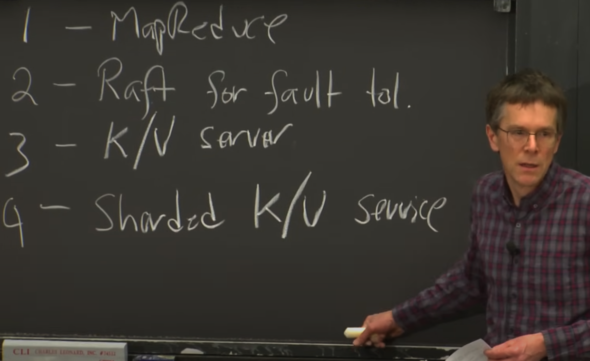
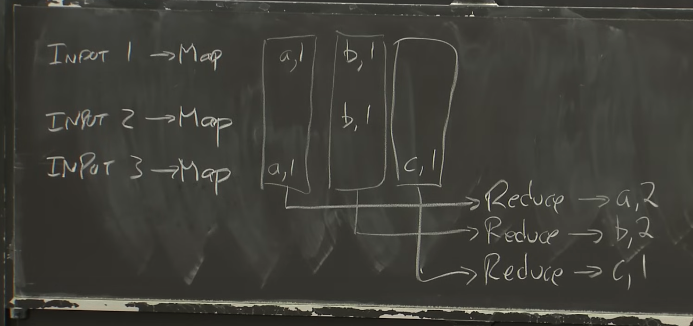

他們的4個Lab 感覺蠻硬但蠻有趣的

---

## 正課
(感覺真不愧是MIT第一門課直接map reduce，感覺台灣可能第一堂講評分標準跟大綱就下課)
Infrastructure of Distributed System
- Storage
- Communication
- Computation
This course mainly focus on Storage & Computation

### Abstraction
Dream Goal is to build an abstraction on top of Storage & Computation, provide an interface that seem like a non-distributed system to applications

### Implementation
常見的 implementation topic 有：
- RPC
- threads
- concurrency control
### Performance
#### Scalability
理想希望：2x computers = 2x throughput
#### Fault Tolerance
假設一台電腦平均可以working for 1 year, 那如果你有1000台那每天可以expect有三台是failed的。
所以我們設計分散式系統時必須去考慮failure是如何handle。
最好是有一些mask可以把failure 隱藏起來。
##### Availability
##### Recoverability

達到 Fault Tolerance的作法
- Non-volatile storage (disk) -> slow
- Replication
#### Consistency
因為機器數量>1，簡單的KV  put & get 會有ambiguity

---
## Map Reduce
Map Reduce Paper: 
https://pdos.csail.mit.edu/6.824/papers/mapreduce.pdf
### 時空背景
當時Google要處理很大量的資料(on scale of TBs)，像是建立webpage 的indexes, 分析link 的structure 位要找出最重要的webpage。
Build index basically is basically equivalent to running sort on whole data -> which is expensive operation 
Google desperately 要處理這些data rapidly.
他們想要作framework可以處理這些分散式的運算而不用為了每個分散式的任務去寫一個專屬的distributed application.
想要讓non distributed expert 也可以寫任務。 

### Abstract View
假設data 已經被分成多個chunk，變成多個input files.

Example: 最簡單的Map Reduce - Word Count

Google 在做map reduce 時，將google file system service 和 map worker 放在同一個machine 因為他們想要降低movement-> network  throughput 跟disk 相比是很小。 