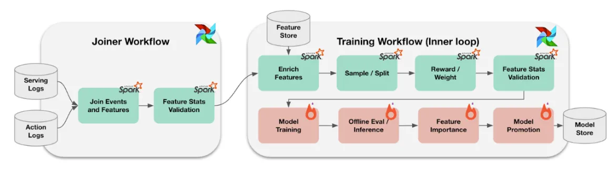
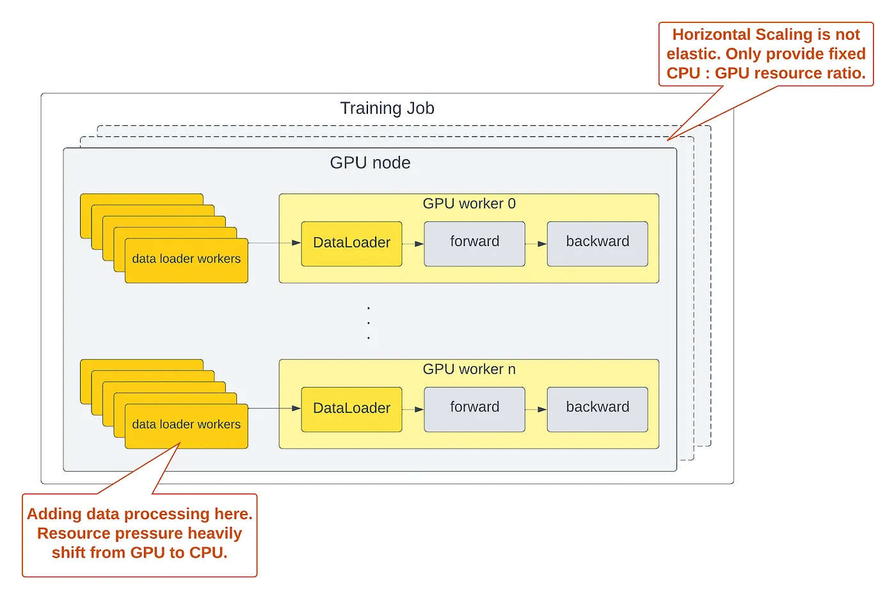
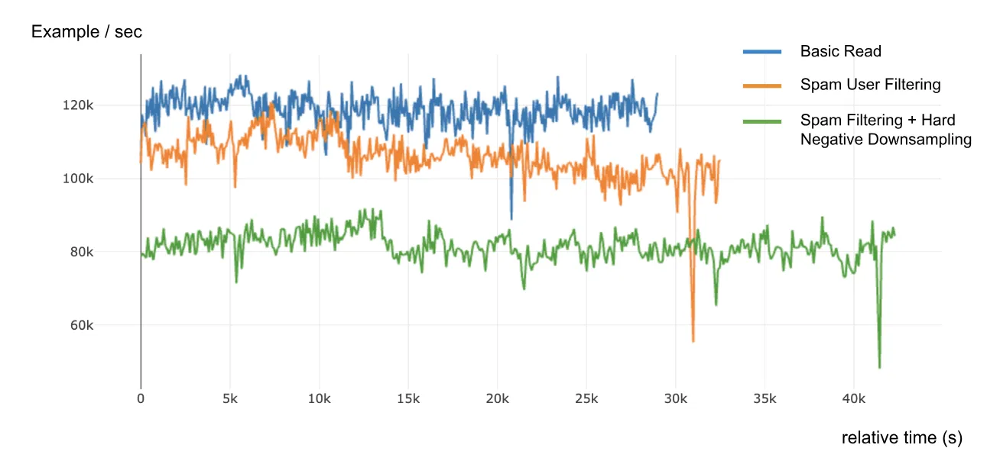

## Part1: Data Processing with Ray
#### BG

- Pinterest's ML Datasets for recommender models are highly standardized. Features are shared stored in ML-friendly types and stored in parquet tables enabling analytical queries and large scale training.
#### Problem: ML Dataset Iteration is slow
##### Original Pattern
It's also a popular approach among ML Engineers.

Pros: 
- Can scale up data processing in Spark easily
- Templatized workflow can be easily reused
- Good Reproducibility: Models can be reproduced easily just with config & template
Cons: 
- Too many frameworks (Spark, Pytorch, Airflow)
- Need to process full dataset in every batch (Before doing anything else) -> Long feedback loop (Need to wait for a long time before discovering some mistakes)
##### Alternative: Last-Mile Processing in Trainer
Move the data processing job into trainer.

Pros: 
- Can be done in one framework -> Easy to iterate
- Immediately feedback
Cons:
- Data processing can't be scale beyond a local machine (since its inside the trainer job)
- Adding more data processing workload makes cpu utilization grows faster than gpu utilization -> GPU utilization rate falls

#### Final solution: Using Ray for Last Mile Processing

## Reference
- https://medium.com/pinterest-engineering/last-mile-data-processing-with-ray-629affbf34ff
- https://medium.com/pinterest-engineering/ray-infrastructure-at-pinterest-0248efe4fd52
- https://medium.com/pinterest-engineering/ray-batch-inference-at-pinterest-part-3-4faeb652e385
-   [Last Mile Data Processing for ML Training using Ray](https://youtu.be/I1eTzQs9QkU?si=V-9Go1sOgcg760Hp)